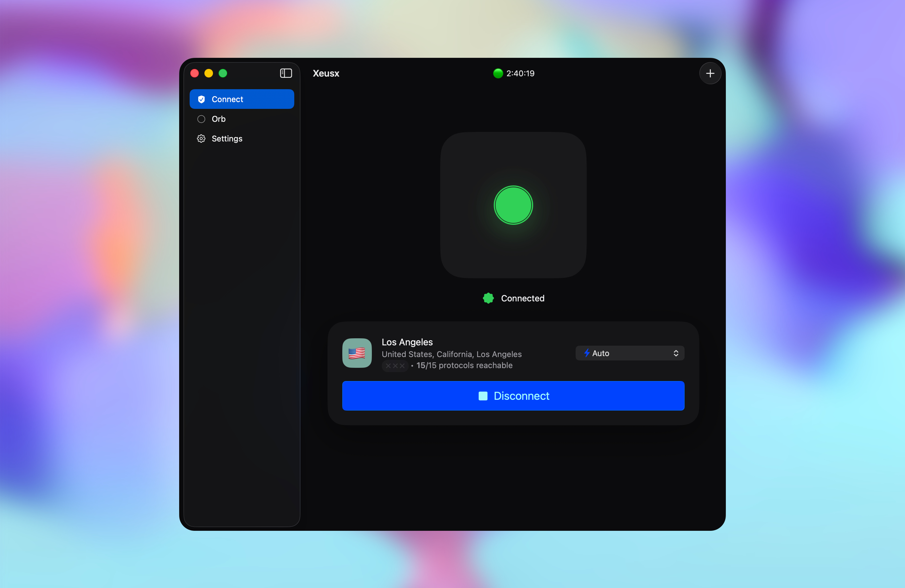

# Xeusx+ for macOS

**Self-hosted VPN control for macOS — connect, deploy, and manage your own private VPN infrastructure from one native Mac app.**

Xeusx+ is built for people who want their VPN to be **theirs**. No subscription VPN cloud. No account. No tracking SDK. No company-operated relay in the middle. Import an encrypted token from a trusted Xeusx server, unlock it locally on your Mac, and connect through a resilient VPN client designed for difficult networks.

Xeusx+ also includes **Orb**, a built-in server manager for creating and operating your own Xeusx VPN infrastructure. Point Orb at a supported Ubuntu Linux server you control or are authorized to administer, provision a complete self-hosted VPN, create users, mint encrypted connection tokens, manage connection methods, and push server updates — all from the Mac app, over SSH, without a Xeusx admin cloud.

<p align="center">
  
  <br>
  <sub><em>One-click connect, live status, adaptive connection methods, and server control — pointed at infrastructure you control.</em></sub>
</p>


> **Xeusx+ is not another VPN subscription app.** It is a private control layer for your own VPN infrastructure: token-based setup, local secrets, verified servers, adaptive transport, built-in server management with Orb, and a clean Mac-native experience.

---

## Own the path between your Mac and the internet

Most VPN apps ask you to trust a company-operated network. Xeusx+ flips the model: you choose the server, you hold the token, and your Mac connects directly to infrastructure you control or personally trust.

The result is a different kind of VPN experience: simple enough to connect in one click, powerful enough to deploy and manage your own servers, and designed to keep working when networks become filtered, hostile, or unreliable.

- **Self-hosted by design** — connect to your own Xeusx server or one run by someone you trust. No Xeusx VPN subscription, no shared commercial exit pool, no developer relay.
- **Server control with Orb** — provision and manage Xeusx servers over SSH: create users, choose connection methods, rotate tokens, and push updates across a fleet.
- **No account surface** — no sign-up, login, user profile, advertising ID, developer account, or app-usage telemetry.
- **Local-first secrets** — tokens unlock on your Mac; connection material is stored in macOS Keychain and protected by Touch ID or your Mac password.
- **Resilient connectivity** — adaptive connection methods, health monitoring, and automatic failover help the app stay usable on difficult networks.
- **Fail-closed posture** — an always-on kill switch is designed to block traffic outside the tunnel if the VPN drops.
- **Mac-native simplicity** — menu-bar control, one-token import, one-click connect, and signed, verified updates.

---

## Connect in minutes

Use this path when you already have a Xeusx connection token.

1. **Get a token.** Your Xeusx server gives you an encrypted connection token and passphrase, shared privately.
2. **Import locally.** Paste the token and passphrase. Xeusx+ unlocks and verifies the token on your Mac.
3. **Connect.** The first connection may require macOS administrator approval to set up the secure network interface. After that, connecting is designed to be one click.

Xeusx+ lives in your **menu bar**. Click it to connect, switch servers, manage servers, open the main window, or check status.

---

## Run your own servers with Orb

Most VPN apps stop at “connect.” Xeusx+ goes further: **Orb** is a built-in control panel for your own VPN servers, so you can deploy and operate infrastructure from the same Mac app you use to connect.

Point Orb at a supported Ubuntu Linux server you own or are authorized to administer — a low-cost cloud VPS works well — and it guides the setup from first SSH connection to ready-to-share tokens.

- **Guided provisioning** — install and configure a complete Xeusx VPN on a fresh server, then confirm it is healthy.
- **User management** — add or remove people and give each one a ready-to-use encrypted token or QR code.
- **Connection methods on demand** — enable or disable available connection methods per server.
- **Built-in hardening options** — configure ad and tracker blocking, connection multiplexing, automatic server recovery, and update behavior where available.
- **Fleet operations** — manage multiple servers, push updates to one or all of them, and keep server state visible from one place.
- **Maintenance scheduling** — keep operating-system packages and VPN components updated on a schedule you control.

### A careful management channel

- **Direct over SSH** — Orb manages your servers from your Mac over SSH. There is no Xeusx admin cloud or developer relay in between.
- **Scoped admin key** — during setup, Orb can create a dedicated admin key on your Mac, enroll a limited management identity on the server, and avoid retaining setup credentials after enrollment where supported.
- **Pinned server identity** — Orb remembers each server's host identity and is designed to reject swapped or impersonated servers.
- **Local, revocable keys** — the admin key lives in the same Touch ID / Mac-password-protected vault as your connection material, and you can rotate or revoke it where supported.

New to running a server? Orb keeps the path approachable. Already experienced? It gives you direct control without adding a hosted dashboard.

---

## Privacy and security model

- **Direct to your server** — VPN traffic goes from your Mac to your selected server. Xeusx does not operate a VPN relay or exit server for your traffic.
- **Direct server management** — when you use Orb, administration goes from your Mac to your server over SSH using local server-management material. There is no developer admin backend.
- **No tracking or telemetry** — no analytics SDK, ads, user accounts, app-usage reporting, install counting, connection counting, server counting, or developer-operated license server. See the **[Privacy Policy](PRIVACY.md)**.
- **Local logs only** — detailed logging, if enabled, stays on your Mac and is not sent to the developer by the app.
- **Keychain-sealed connection material** — connection data and Orb management material are stored locally in macOS Keychain, not plain files.
- **Touch ID / Mac password privacy lock** — saved connections can be protected by local user presence.
- **Verified server identity** — Xeusx+ is designed to reject swapped or impersonated servers.
- **Signed, verified updates** — update artifacts are checked before installation.
- **Always-on kill switch** — the app is designed to fail closed if the VPN connection drops.

No VPN can guarantee complete anonymity, complete security, uninterrupted access, or bypassing every form of network filtering. Xeusx+ is built to improve control, privacy, and resilience, but results depend on your Mac, server, network, configuration, and local law.

---

## Built for difficult networks

Xeusx+ can use multiple connection methods through one embedded engine. Your server decides which profiles are available, and Auto mode can choose and switch methods for speed and reliability.

Supported profile families may include:

- **REALITY** and alternate-port profiles
- **WebSocket**, **gRPC**, **HTTPUpgrade**, **XHTTP/H2**, **XHTTP/H3**
- **Hysteria**, **Hysteria2**, **TUIC**, **mKCP**
- **Trojan**, **VMess**, **Shadowsocks**
- **ShadowTLS**, **WireGuard**

Availability depends on the server token you import and the server configuration you use.

---

## Smart routing

Xeusx+ supports routing modes and presets designed for practical daily use:

- full VPN or split routing;
- optional ad, tracker, and known-malicious-site blocking where configured;
- local-device reachability for printers, AirPlay, NAS, and LAN devices; and
- downloadable routing rule sets where enabled by you.

---

## Download

Download only from official Xeusx distribution locations. Sharing the official link is welcome; mirroring, re-uploading, repackaging, or redistributing the app binary is not permitted by the **[License](LICENSE.md)**.

- **Download Xeusx+.dmg:** use the official GitHub release or official repository download link published by Xeusx Labs.
- **Requires:** macOS 14 Sonoma or later.

The current version and checksum are listed in **[CHANGELOG.md](CHANGELOG.md)**.

---

## Verify your download

Every public release publishes a SHA-256 checksum for `Xeusx+.dmg`. To verify manually:

```bash
shasum -a 256 ~/Downloads/Xeusx+.dmg
```

Compare the result with the checksum in **[CHANGELOG.md](CHANGELOG.md)**. The in-app updater also verifies update signatures and checksums before installing.

---

## Install

1. Open **`Xeusx+.dmg`** and drag **Xeusx+** to **Applications**.
2. If macOS shows a warning because the app is distributed outside the App Store, open it from Applications using **Control-click → Open**, then confirm.
3. On first connection, macOS may ask for administrator approval to install or activate the helper needed to create the VPN interface.

---

## Updates

Xeusx+ can check for updates automatically and on demand through the app. Updates are designed to be signed, checksum-verified, and rollback-protected. See **[CHANGELOG.md](CHANGELOG.md)** for release notes and published checksums.

---

## What you need

- macOS 14 or later.
- **To connect:** a connection token and passphrase from your own Xeusx server or from a server operator you trust.
- **To run your own server with Orb:** a supported Ubuntu Linux server you own or are authorized to administer, with SSH access.
- Responsibility for checking whether using a VPN — and operating a server — is lawful where you and your servers are located.

Xeusx+ includes both the **Connect** client and the **Orb** server manager. You still own and control your servers; the developer never operates them for you.

---

## Responsible use

Xeusx+ is built for privacy, resilience, and secure access. It is not built for breaking the law, attacking networks, evading sanctions, distributing malware, or concealing criminal activity. You are responsible for your use, the servers you run or manage, your traffic, and your compliance with local law. Only administer servers you own or are authorized to manage. See the **[Terms of Use](TERMS.md)**.

---

## Legal

Xeusx is **free to download and use as an official unmodified build**, but it is **proprietary software** and **not open source**. You may not modify, reverse engineer, resell, sublicense, mirror, re-upload, repackage, rebrand, redistribute, or create derivative versions except as expressly allowed by the **[License](LICENSE.md)** or a separate written agreement.

- **[License](LICENSE.md)** — free-to-use proprietary software license.
- **[Terms of Use](TERMS.md)** — rules for lawful and responsible use.
- **[Privacy Policy](PRIVACY.md)** — how the app handles information.

Third-party and open-source components included with Xeusx remain governed by their own notices.

---

Xeusx and the Xeusx logo are trademarks of their respective owner. Apple, macOS, Mac, and Touch ID are trademarks of Apple Inc., registered in the U.S. and other countries and regions. GitHub is a trademark of GitHub, Inc. Use of these names is for identification only and does not imply affiliation, sponsorship, or endorsement.
