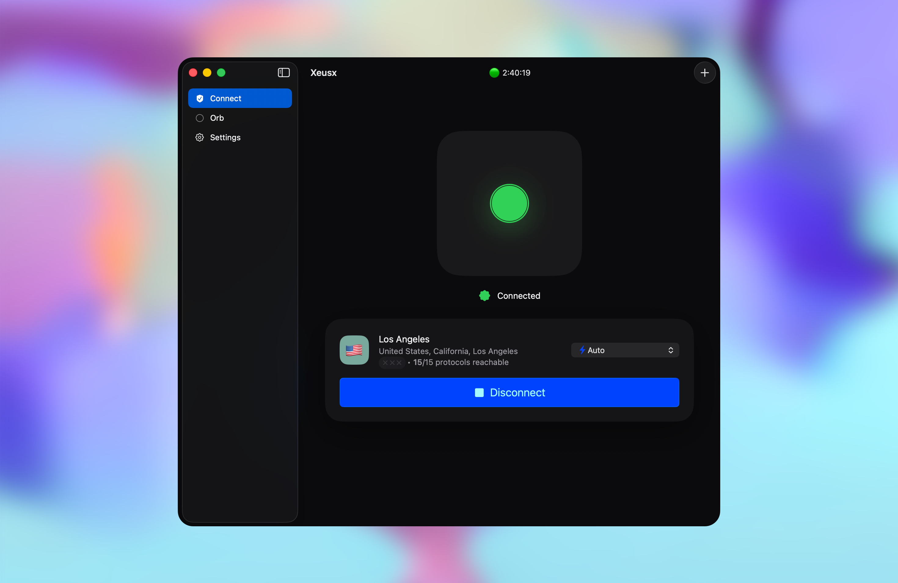

# Xeusx+ for macOS

**Self-hosted VPN control for macOS — connect, deploy, and manage your own private VPN infrastructure from one native Mac app.**

Xeusx+ is built for people who want their VPN to be **theirs**. No subscription VPN cloud. No Xeusx account. No tracking SDK. No company-operated relay in the middle. Import one encrypted Xeusx token for infrastructure you control or are expressly authorized to access, unlock it locally on your Mac, and keep the connections assigned to that token synchronized.

Xeusx+ also includes **Orb**, a built-in server manager for creating and operating your own Xeusx VPN infrastructure. Point Orb at supported Ubuntu Linux servers you control or are authorized to administer, provision a complete self-hosted VPN fleet, coordinate those servers as one resilient cluster, create scoped access profiles, export one encrypted Xeusx token per profile, and push server updates — all from the Mac app, over SSH, without a Xeusx admin cloud.

<p align="center">
  
  <br>
  <sub><em>One-click connect, live status, adaptive connection methods, and fleet control — pointed at infrastructure you control.</em></sub>
</p>


> **Xeusx+ is not another VPN subscription app.** It is a private control layer for your own VPN infrastructure: token-based setup, local secrets, verified servers, adaptive transport, coordinated fleet management with Orb, and a clean Mac-native experience.

---

## Own the path between your Mac and the internet

Most VPN apps ask you to trust a company-operated network. Xeusx+ flips the model: you choose the server, you hold the token, and your Mac connects directly to infrastructure you control, administer, or are expressly authorized to use.

The result is a different kind of VPN experience: simple enough to connect in one click, powerful enough to deploy and manage your own servers, and designed to keep working when networks become filtered, hostile, or unreliable.

- **Self-hosted by design** — connect to Xeusx infrastructure you own, administer, or are expressly authorized to use. No Xeusx VPN subscription, no server marketplace, no shared commercial exit pool, no developer relay.
- **Cluster control with Orb** — provision Xeusx servers over SSH, coordinate them as one fleet, manage scoped access, and push updates from one place.
- **No account surface** — no sign-up, login, user profile, advertising ID, developer account, or app-usage telemetry.
- **Local-first secrets** — tokens unlock on your Mac; connection material is stored in macOS Keychain and protected by Touch ID or your Mac password.
- **Resilient connectivity** — adaptive connection methods, health monitoring, and automatic failover help the app stay usable on difficult networks.
- **Fail-closed posture** — an always-on kill switch is designed to block traffic outside the tunnel if the VPN drops.
- **Mac-native simplicity** — menu-bar control, one-token import, one-click connect, and signed, verified updates.

---

## Connect in minutes

1. **Use one token.** Import one encrypted Xeusx token and passphrase assigned to infrastructure you control or are expressly authorized to access.
2. **Import locally.** Paste the token and passphrase. Xeusx+ unlocks and verifies the token on your Mac.
3. **Connect.** The first connection may require macOS administrator approval to set up the secure network interface. After that, connecting is designed to be one click, and your connections stay synchronized.

Xeusx+ lives in your **menu bar**. Click it to connect, switch servers, manage servers, open the main window, or check status.

---

## Run your own servers with Orb

Most VPN apps stop at “connect.” Xeusx+ goes further: **Orb** is a built-in control panel for your own VPN servers, so you can deploy and operate infrastructure from the same Mac app you use to connect.

Start with a supported Ubuntu Linux server you own or are authorized to administer — a low-cost cloud VPS works well — and Orb guides the setup from first SSH connection to ready-to-use access tokens. Add more servers when you want more locations or resilience; Orb brings them into the same managed fleet.

- **Guided provisioning** — install and configure a complete Xeusx VPN on a fresh server, then confirm it is healthy.
- **Access management** — create separate access profiles, scope each profile to all or selected servers, and export one encrypted Xeusx token per profile.
- **Connection methods on demand** — enable or disable available connection methods per server.
- **Built-in hardening options** — configure ad and tracker blocking, connection multiplexing, automatic server recovery, and update behavior where available.
- **Decentralized fleet coordination** — join servers into one self-hosted fleet, distribute voting across independent failure domains, remove unavailable members safely, and control everything from Orb on your Mac.
- **Maintenance scheduling** — keep operating-system packages and VPN components updated on a schedule you control.

---

### Decentralized across your servers. Controlled from your Mac.

Adding another location should make your VPN stronger, not give you another system to babysit. Orb joins supported servers into a self-hosted cluster with authority replicated across the fleet. A safe odd set of servers reaches majority decisions, while Orb gives you one native control point — with no separate Xeusx controller, broker, or hosted database to depend on.

- **Grow without weakening quorum** — every new server joins as a learner and fully catches up before it can vote. Orb uses the provider, infrastructure group, and region labels you define to spread voting responsibility across independent failure domains.
- **Change the fleet without unsafe shortcuts** — voting-role changes and server removals use signed, resumable cluster operations. Even if a target server is unavailable, a healthy quorum — or protected fleet recovery after quorum loss — can authorize the change without requiring that server to respond over SSH.
- **Keep access synchronized automatically** — profiles assigned to **All servers** extend to newly joined locations automatically, while explicitly scoped profiles stay exact. Signed catalog updates add or remove client connections on the next sync.
- **Recover fleet control from one protected kit** — restore Orb administration on a replacement Mac using one encrypted `.xeusxfleet` backup plus a separate recovery code, while the committed servers continue running.

Fleet recovery restores administrative control of a live fleet. It does not recreate destroyed servers or rebuild lost server-side consensus history.

### A careful management channel

- **Direct over SSH** — Orb manages your servers from your Mac over SSH. There is no Xeusx admin cloud or developer relay in between.
- **Scoped admin key** — during setup, Orb can create a dedicated admin key on your Mac, enroll a limited management identity on the server, and avoid retaining setup credentials after enrollment where supported.
- **Pinned server identity** — Orb remembers each server's host identity and is designed to reject swapped or impersonated servers.
- **Local, revocable keys** — the admin key lives in the same Touch ID / Mac-password-protected vault as your connection material, and you can rotate or revoke it where supported.

New to running a server? Orb keeps the path approachable. Already experienced? It gives you direct control without adding a hosted dashboard.

---

## Privacy and security model

- **Direct to your server** — VPN traffic goes from your Mac to your selected server. Xeusx does not operate a VPN relay or exit server for your traffic.
- **Direct server management** — when you use Orb, administration goes from your Mac to your server over SSH using local server-management material. There is no developer admin backend.
- **No tracking or telemetry** — no analytics SDK, ads, user accounts, app-usage reporting, install counting, connection counting, server counting, or developer-operated license server. See the **[Privacy Policy](PRIVACY.md)**.
- **Local logs only** — detailed logging, if enabled, stays on your Mac and is not sent to the developer by the app.
- **Keychain-sealed connection material** — connection data and Orb management material are stored locally in macOS Keychain, not plain files.
- **Touch ID / Mac password privacy lock** — saved connections can be protected by local user presence.
- **Verified server identity** — Xeusx+ is designed to reject swapped or impersonated servers.
- **Signed, verified updates** — update artifacts are checked before installation.
- **Always-on kill switch** — the app is designed to fail closed if the VPN connection drops.

No VPN can guarantee complete anonymity, complete security, uninterrupted access, or bypassing every form of network filtering. Xeusx+ is built to improve control, privacy, and resilience, but results depend on your Mac, server, network, configuration, and local law.

---

## Built for difficult networks

Xeusx+ can use multiple connection methods through one embedded engine. Your server decides which profiles are available, and Auto mode can choose and switch methods for speed and reliability.

Supported profile families may include:

- **REALITY** and alternate-port profiles
- **WebSocket**, **gRPC**, **HTTPUpgrade**, **XHTTP/H2**, **XHTTP/H3**
- **Hysteria**, **Hysteria2**, **TUIC**, **mKCP**
- **Trojan**, **VMess**, **Shadowsocks**
- **ShadowTLS**, **WireGuard**

Availability depends on your Xeusx connections and the configuration of each server.


---

## Single-hop or multi-hop routes

Choose the path that fits the moment: keep it simple with one trusted server, or build a stronger multi-server route across the infrastructure you control.

With Xeusx+, your VPN path is not locked to a single exit. When your server configuration supports it, you can route traffic through an **entry server**, pass it through one or more **relay servers**, and exit from a final **exit server** location.

```text
🇺🇸 United States → 🇬🇧 United Kingdom → 🇫🇷 France → 🇺🇸 United States
Entry server      Relay server       Relay server   Exit server
```

---

## Smart routing

Xeusx+ supports routing modes and presets designed for practical daily use:

- full VPN or split routing;
- optional presets for blocking known ad and tracker domains and known botnet command-and-control IPs, independent of your DNS provider;
- local-device reachability for printers, AirPlay, NAS, and LAN devices;
- downloadable routing rule sets where enabled by you; and
- cross-device Traffic Rules sharing through `.xeusx` files, with a preview before import and seamless import together with connection tokens from the same `.xeusx` file or the clipboard.

---

## Your DNS. Your rules.

Choose your resolver. Set your filtering. Keep control of your DNS—with encrypted resolution built into Xeusx+ and encrypted forwarding on Orb-managed servers.

- **Your resolver. Your level of filtering.** — Choose Cloudflare, Quad9, AdGuard DNS, or a custom resolver. Depending on the provider, options range from unfiltered resolution to malicious-domain blocking, ad and tracker blocking, and family filtering.
- **Encrypted by default. No silent downgrade.** — Cloudflare DNS over HTTPS (DoH) is enabled out of the box. Both DoH and DNS over TLS (DoT) validate the resolver’s TLS certificate, with no silent fallback to plaintext DNS.
- **DNS that follows your VPN.** — While VPN protection is active, public system DNS managed by Xeusx uses your selected VPN exit—in both full-tunnel and split-routing modes. Turn Traffic Rules off, and Cloudflare DoH remains active while your saved DNS preferences are preserved.
- **Fewer repeat requests. Less connection overhead.** — Connection reuse, bounded caching, and shared lookups reduce duplicate DNS requests and repeated connection setup.
- **Server-side filtering. Encrypted forwarding.** — Orb’s managed resolver forwards DNS over certificate-verified TLS. Enabled server filters refresh automatically from validated lists and apply to domains the server resolves or can inspect.

Configure your resolver and filtering in **Traffic Rules → DNS**.

**Advanced UDP/TCP DNS:** Requests are protected inside the VPN tunnel, but travel unencrypted between the exit server and the resolver. Choose DoH or DoT to encrypt that part of the path as well.

---

## Residential proxy routing

Add residential exits to your self-hosted VPN — with per-user access controls, data allowances, and control over which traffic uses them.

Configure a separately supplied **Geonode** account through Orb, assign sticky-session ports on your managed servers, and enable residential access for selected users. In **Connect → Residential Proxy**, authorized users can choose a configured provider, entry gateway, and residential exit country, or request a new session when needed. **Xeusx Labs provides the integration, not the proxy account or residential bandwidth.**

- **Selected sites** — Route selected domains through the residential exit. Domain matching requires Xeusx DNS.
- **All VPN traffic** — Apply residential routing to traffic captured by Xeusx, including applications that use their own encrypted DNS. Only supported traffic is forwarded.

Physical Direct exclusions — traffic kept outside the VPN — and VPN-management traffic retain their existing routes. Changing the routing selection reconnects the VPN on this device.

This release supports **HTTPS and encrypted DNS over IPv4** through the residential exit. UDP, IPv6, and other unsupported traffic within the selected scope are blocked. If the residential exit becomes unavailable, traffic in that scope **stays blocked rather than falling back to another route**.

> [!WARNING]
> **The server-to-provider connection is not encrypted.** The current Geonode integration uses a plain HTTP proxy connection from your VPN server to the provider. Proxy credentials and destination metadata are exposed to anyone able to monitor that connection. Application HTTPS and encrypted DNS retain their TLS protection, but this does not protect the proxy credentials or destination metadata on that hop. Enable residential routing only if this exposure is acceptable for your security requirements.

---

## Access control that scales with your infrastructure

As your server fleet grows, access should remain simple to manage. Orb gives you one place to define which authorized users can connect and which Orb-managed servers are available to them—without creating a new token every time your infrastructure changes.

- **One access profile. One encrypted token** — Create an access profile for each authorized user, then grant or revoke access across the servers you manage. Each profile is represented by one encrypted Xeusx token, while its approved connections can stay synchronized across that user’s enrolled devices.
- **Fleet-wide or server-specific access.** — Allow an access profile to use every current and future Orb-managed server, or limit it to an explicit server list. With server-specific access, newly added servers remain unavailable until you approve them.
- **Device-level control.** — View and revoke devices enrolled under an access profile, and set a maximum number of permitted devices. Each enrolled device receives its own revocable connection identity, helping contain exposure if a token is copied or compromised.

---

## Download

Download only from official Xeusx distribution locations. Sharing the official link is welcome; mirroring, re-uploading, repackaging, or redistributing the app binary is not permitted by the **[License](LICENSE.md)**.

- **Download Xeusx+.dmg:** use the [latest official GitHub Release](https://github.com/xeusxlabs/xeusx-desktop-mac/releases/latest).
- **Requires:** macOS 14 Sonoma or later.

The current version and checksum are listed in **[CHANGELOG.md](CHANGELOG.md)**.

---

## Verify your download

Every public release publishes a SHA-256 checksum for `Xeusx+.dmg`. To verify manually:

```bash
shasum -a 256 ~/Downloads/Xeusx+.dmg
```

Compare the result with the checksum in **[CHANGELOG.md](CHANGELOG.md)**. The in-app updater also verifies update signatures and checksums before installing.

---

## Install

1. Open **`Xeusx+.dmg`** and drag **Xeusx+** to **Applications**.
2. If macOS shows a warning because the app is distributed outside the App Store, open it from Applications using **Control-click → Open**, then confirm.
3. On first connection, macOS may ask for administrator approval to install or activate the helper needed to create the VPN interface.

---

## Updates

Xeusx+ can check for updates automatically and on demand through the app. Updates are designed to be signed, checksum-verified, and rollback-protected. See **[CHANGELOG.md](CHANGELOG.md)** for release notes and published checksums.

---

## What you need

- macOS 14 or later.
- **To connect:** one valid encrypted Xeusx token and passphrase assigned to infrastructure you control or are expressly authorized to access.
- **To run your own fleet with Orb:** one or more supported Ubuntu Linux servers you own or are authorized to administer, with SSH access.
- Responsibility for checking whether using a VPN — and administering a server — is lawful where you use Xeusx and where the selected servers are located.

Xeusx+ includes both the **Connect** client and the **Orb** server manager. You choose the servers you use; the developer does not supply, operate, or broker access to them.

---

## Responsible use

Xeusx+ is built for privacy, resilience, and secure access. It is not built for breaking the law, attacking networks, evading sanctions, distributing malware, or concealing criminal activity. You are responsible for your use, the servers you run or manage, your traffic, and your compliance with local law. Only administer servers you own or are authorized to manage. See the **[Terms of Use](TERMS.md)**.

---

## Legal

Xeusx is **free to download and use as an official unmodified build**, but it is **proprietary software** and **not open source**. You may not modify, reverse engineer, resell, sublicense, mirror, re-upload, repackage, rebrand, redistribute, or create derivative versions except as expressly allowed by the **[License](LICENSE.md)** or a separate written agreement.

- **[License](LICENSE.md)** — free-to-use proprietary software license.
- **[Terms of Use](TERMS.md)** — rules for lawful and responsible use.
- **[Privacy Policy](PRIVACY.md)** — how the app handles information.

Third-party and open-source components included with Xeusx remain governed by their own notices.

---

Xeusx and the Xeusx logo are trademarks of their respective owner. Apple, macOS, Mac, and Touch ID are trademarks of Apple Inc., registered in the U.S. and other countries and regions. GitHub is a trademark of GitHub, Inc. Use of these names is for identification only and does not imply affiliation, sponsorship, or endorsement.
